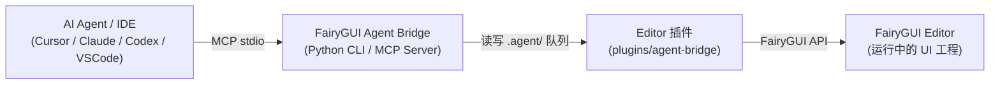

# FairyGUI Agent Bridge

通过 MCP (Model Context Protocol) 或 CLI，让 AI 编程 Agent（如 Cursor、Claude、Codex、VS Code 等）以结构化指令直接操作 FairyGUI Editor，实现自动拼 UI 界面、动效制作与一键发布。

- **版本**：`0.8.1`
- **队列协议**：`1.0`
- **已验证 FairyGUI Editor**：`6.1.4`
- **通信方式**：本地 JSON 队列 + MCP stdio

> **说明**：Bridge 仓库与业务 FairyGUI 工程分开存放。FairyGUI 工程只需安装轻量插件；在宿主 IDE 中可按需安装 Skill 提高 AI 操作准确率。

---

## 🏗️ 工作原理



---

## 💡 AI 使用示例

安装完成后，在支持 MCP / Skill 的 AI 对话框中直接输入类似以下指令：

- `帮我制作一个登录界面，包含账号输入框、密码输入框和登录按钮`
- `根据蓝湖 MCP 导出的切图帮我拼出这个背包界面`
- `帮我给 MainMenu 界面的 StartBtn 添加一个弹出的缩放动画效果`
- `帮我检查当前界面的大图图集设置，保存并发布 Lobby 包`

> 若安装了 Skill，也可以通过 `/fgui-agent-bridge 帮我制作一个登录界面` 精准触发。

---

## 依赖要求

- Python `3.10+`
- [uv](https://docs.astral.sh/uv/) 包管理器
- FairyGUI Editor（推荐 `6.1.4`）

---

## 🚀 安装指南

### 方式一：AI 智能安装（推荐）

将下面的提示词发送给能够操作本地终端和文件的 AI 编程 Agent（如 Cursor、Claude Code、Codex 等）：

```text
请帮我在这台电脑上完整安装 FairyGUI Agent Bridge。你可以执行终端命令和编辑本地文件，请实际完成安装，不要只给操作说明。

源仓库：https://github.com/Wilson520403/fgui-agent-bridge.git
目标 FairyGUI 工程：优先从当前工作区自动查找 .fairy 文件；找不到或找到多个时停下来询问我。
目标代码仓库：当前工作区；
```

---

### 方式二：手动安装

#### 1. 克隆 Bridge 仓库并准备环境

```bash
git clone https://github.com/Wilson520403/fgui-agent-bridge.git
cd fgui-agent-bridge
uv sync --frozen
```

#### 2. 安装 FairyGUI Editor 插件

运行同步脚本，在弹出的窗口中选择你的 FairyGUI 工程目录：

```bash
uv run python scripts/sync_to_project.py --choose-project --apply
```

也可以直接通过命令行指定路径安装：

```bash
uv run python scripts/sync_to_project.py \
  --project /ABSOLUTE/PATH/TO/FAIRYGUI-PROJECT \
  --apply
```

> **注意**：
> - 插件将安装到目标工程的 `plugins/agent-bridge/`。
> - 安装完成后，**请重新打开 FairyGUI 工程**以加载插件。
> - 插件运行时目录 `.agent/` 会在工程内自动创建，请将其加入 `.gitignore`，不要提交到 Git。

#### 3. 配置 MCP Server

你可以根据所使用的 AI 客户端添加 MCP 配置。通用配置格式如下（可参考 [.mcp.example.json](.mcp.example.json)）：

```json
{
  "mcpServers": {
    "fgui": {
      "command": "uv",
      "args": [
        "run",
        "--project",
        "/ABSOLUTE/PATH/TO/fgui-agent-bridge",
        "fgui-agent-mcp"
      ],
      "env": {
        "FGUI_PROJECT_PATH": "/ABSOLUTE/PATH/TO/FAIRYGUI-PROJECT"
      }
    }
  }
}
```

**常见客户端配置入口**：

- **Cursor**：在 `~/.cursor/mcp.json` 或项目根目录 `.cursor/mcp.json` 中粘贴上述配置。
- **Claude Desktop**：编辑 `claude_desktop_config.json`（macOS: `~/Library/Application Support/Claude/`，Windows: `%APPDATA%\Claude\`）。
- **Codex CLI**：
  ```bash
  codex mcp add fgui \
    --env FGUI_PROJECT_PATH=/ABSOLUTE/PATH/TO/FAIRYGUI-PROJECT \
    -- uv run --project /ABSOLUTE/PATH/TO/fgui-agent-bridge fgui-agent-mcp
  ```
- **VS Code (Cline / Roo Code)**：在扩展的 MCP Settings 中添加名为 `fgui` 的 stdio 服务。

#### 4. 验证连接

启动 FairyGUI Editor 并打开目标工程，然后执行：

```bash
uv run --project /ABSOLUTE/PATH/TO/fgui-agent-bridge \
  fgui-agent --project /ABSOLUTE/PATH/TO/FAIRYGUI-PROJECT ping
```

若返回 `{"status": "ok", ...}` 则表明连接成功。

---

### 可选：安装 Agent Skill

Skill 可以让 AI 更好地遵循 FairyGUI 的属性规范与动画约定。使用同步脚本可一键将 Skill 同步至目标业务代码仓库：

```bash
uv run python scripts/sync_to_project.py \
  --project /ABSOLUTE/PATH/TO/FAIRYGUI-PROJECT \
  --skill-root /ABSOLUTE/PATH/TO/YOUR-CODE-REPOSITORY \
  --apply
```

或手动将 `.agents/skills/fgui-agent-bridge/` 目录复制到目标代码仓库的 `.agents/skills/` 目录下。

---

## 🔄 检查与拉取更新

当 Bridge 源仓库有功能更新或 Bug 修复时，可通过一条命令自动从源仓库安全拉取最新代码（`git pull --ff-only`）、同步 Python 环境（`uv sync`），并将最新插件与 Skill 刷新到目标工程：

```bash
# 从源仓库拉取最新代码并同步到 FairyGUI 工程与业务代码仓库
uv run python scripts/sync_to_project.py \
  --pull \
  --project /ABSOLUTE/PATH/TO/FAIRYGUI-PROJECT \
  --skill-root /ABSOLUTE/PATH/TO/YOUR-CODE-REPOSITORY \
  --apply

# 或通过 CLI update 子命令执行
uv run fgui-agent --project /ABSOLUTE/PATH/TO/FAIRYGUI-PROJECT update --pull --apply
```

> **提示**：
> - `fgui_status` 会自动比对当前 Bridge 服务端与 FairyGUI 编辑器内运行的插件版本，若版本不一致会在状态中返回 `updateWarning` 提示。
> - 若插件文件被更新，请在 **FairyGUI Editor 中重新打开工程**以加载新版插件。

---

## 🛠️ 常用 CLI 指令

在 `fgui-agent-bridge` 仓库根目录下执行（也可以通过 `--project PATH` 指定工程）：

```bash
# 状态与连接检查
uv run fgui-agent status
uv run fgui-agent ping

# 查看工程与资源结构
uv run fgui-agent project
uv run fgui-agent packages
uv run fgui-agent items ViewHub
uv run fgui-agent open ViewHub ViewHubBtnItem
uv run fgui-agent active
uv run fgui-agent tree

# 历史与保存
uv run fgui-agent save
uv run fgui-agent undo
uv run fgui-agent redo

# 发布资源
uv run fgui-agent publish --scope active
```

**创建与导入资源**：

```bash
uv run fgui-agent create-component ViewHub NewPanel --width 1920 --height 1080
uv run fgui-agent import-image ViewHub /absolute/path/button.png
uv run fgui-agent import-font ViewHub /absolute/path/font.ttf
uv run fgui-agent import-sound ViewHub /absolute/path/click.mp3
uv run fgui-agent create-movieclip ViewHub Loading --frame /path/01.png --frame /path/02.png --fps 12
uv run fgui-agent create-button ViewHub NewButton --mode common
uv run fgui-agent upsert-transition '{"name":"fadeIn","frameRate":60,"items":[{"type":"Alpha","frame":0,"tween":{"duration":12,"start":0,"end":1}}]}'
uv run fgui-agent preview-transition play fadeIn
```

---

## 🧩 MCP 工具一览

| 类别 | 工具名称 | 功能描述 |
| :--- | :--- | :--- |
| **连接与定位** | `fgui_status`、`fgui_ping`、`fgui_use_project`、`fgui_get_project`、`fgui_list_packages`、`fgui_list_items` | 检查连接状态、动态切换工程、查看包列表与包内资源 |
| **文档与对象** | `fgui_open_document`、`fgui_get_active_document`、`fgui_get_tree`、`fgui_select_object`、`fgui_insert_object`、`fgui_set_property`、`fgui_remove_object` | 打开组件、查看对象树、选中元件、修改属性及增删显示对象 |
| **资源创建/导入** | `fgui_create_component`、`fgui_create_button`、`fgui_import_image`、`fgui_import_font`、`fgui_import_sound` | 新建组件/按钮，从本地绝对路径导入图片、字体与声音 |
| **MovieClip 序列帧** | `fgui_create_movieclip`、`fgui_get_movieclip`、`fgui_update_movieclip`、`fgui_remove_movieclip` | 从本地图片序列创建/更新序列帧动画（直接嵌入 `.jta`） |
| **Transition 动效** | `fgui_list_transitions`、`fgui_get_transition`、`fgui_upsert_transition`、`fgui_remove_transition`、`fgui_add_transition_item`、`fgui_update_transition_item`、`fgui_remove_transition_item` | 声明式增改整段过渡动效，或原子化修改特定轨道关键帧 |
| **动画预览** | `fgui_preview_animation` | 在编辑器中实时播放、暂停、停止、跳帧预览 Transition 或 MovieClip |
| **保存与事务** | `fgui_get_history`、`fgui_undo`、`fgui_redo`、`fgui_save_document`、`fgui_save_all`、`fgui_discard_document` | 属性与操作撤销/重做、保存文档或放弃全部未保存修改 |
| **发布** | `fgui_get_publish_settings`、`fgui_publish` | 查询发布设置、执行资源发布（支持活动包/指定包/全部包） |

---

## ⚙️ 关键机制与规范

### 1. Transition 动效规范
- **全轨道支持**：覆盖 `XY`、`Size`、`Pivot`、`Scale`、`Skew`、`Alpha`、`Rotation`、`Color`、`Animation`、`Visible`、`Sound`、`Transition`、`Shake`、`ColorFilter`、`Text`、`Icon` 全部原生轨道。
- **时间单位**：统一使用 FairyGUI frame 帧单位。
- **事务性**：整段声明式更新或关键帧原子操作均进入事务栈，支持 `fgui_undo` / `fgui_redo`。

### 2. MovieClip 序列帧机制
- 接收有序本地图片列表，通过 FairyGUI `AniData.ImportImages` 嵌入 `.jta` 文件，不会在包内产生多余的散图 `ui://`。
- FPS 范围 `1..255`，支持 Repeat Delay、每帧 Delay、Speed 与 Swing。
- 已有 MovieClip 的更新支持文件快照回退；全新创建/删除属于磁盘级操作，删除时需显式提供 `force=true` 且无外部引用。

### 3. 大图自动独立图集规则
- **规则触发**：图片分辨率达到 `1920×1080`，或任意一边达到 `2048`（2K）时，会自动标记为 FairyGUI `alone` 单独纹理集。
- **自动补齐**：通过 `fgui_import_image` 导入时即时生效；执行 `fgui_publish` 发布时还会自动扫描目标包并纠正历史大图配置，防止大图与小图碎图混排导致图集膨胀。

---

## ❓ 常见问题与排错 (FAQ)

| 异常现象 | 可能原因 | 解决办法 |
| :--- | :--- | :--- |
| `ping` 提示超时或未连接 | 1. FairyGUI Editor 未启动<br>2. 目标工程未打开<br>3. 插件未安装或未生效 | 1. 打开 FairyGUI Editor 并加载目标工程；<br>2. 检查工程下 `plugins/agent-bridge/main.js` 是否存在；<br>3. 重新打开 FairyGUI 工程以重新加载插件；<br>4. 查看工程根目录 `.agent/bridge.log`。 |
| MCP 客户端找不到工具 | 1. MCP 配置中的绝对路径填写错误<br>2. 客户端未重启会话 | 1. 检查 MCP 配置文件中的 `fgui-agent-bridge` 和工程绝对路径；<br>2. 新建 Agent 对话或重启 IDE 重新加载 MCP。 |
| 导入资源失败 | 传入了相对路径或文件不存在 | 确保传入的图片/音频路径为**本地绝对路径**。 |
| 发布操作阻塞超时 | 发布正在进行中或发生了并发请求 | 发布期间部分读写操作会被锁定，请勿并发调用发布；等待完成后检查发布日志。 |

---

## ⚠️ 当前限制

- **兼容基线**：以 FairyGUI Editor `6.1.4` 为主要验证版本。
- **动画类型**：专注于 FairyGUI 原生 Transition 与 MovieClip，不支持 Spine、DragonBones、Loader3D、SWF 等第三方动画格式。
- **资源管理边界**：暂不支持通用包内资源的任意重命名与跨包移动；MovieClip 删除需带引用校验与 `force=true`。
- **平台环境**：macOS 已做完整端到端验证；Windows 建议在标准命令提示符/PowerShell 下验证路径格式。

---

## 🔄 升级与同步

```bash
git pull
uv sync --frozen
uv run python scripts/sync_to_project.py --choose-project --apply
```

> **提示**：也可以直接对你的 Agent 说 `“/fgui-agent-bridge 帮我更新”`。更新插件后重新打开 FairyGUI 工程即可。只有当 Bridge 仓库路径或启动命令变更时才需更新 MCP 配置。

---

## 🛠️ 开发与维护

- **插件 TypeScript 源码**：`plugin/main.ts`
- **插件运行时编译文件**：`plugin/main.js`
- **Python MCP & CLI**：`src/fairygui_agent/`
- **Agent Skill**：`.agents/skills/fgui-agent-bridge/`
- **同步脚本**：`scripts/sync_to_project.py`

> **维护注意**：修改 `plugin/main.ts` 后必须重新生成并提交 `plugin/main.js`；版本升级需同步修改 `plugin/package.json`、`pyproject.toml`、Python `__version__` 以及插件源码版本号。

---

## 🔗 相关生态推荐

- [蓝湖 MCP (lanhu-mcp)](https://github.com/dsphper/lanhu-mcp)：配合本工具，可以让 AI 编程 Agent 自动从蓝湖设计稿下载切图、导出标注，并直接在 FairyGUI 中拼装好 UI 界面并发布。

---

## 📄 许可证

[MIT License](LICENSE)
